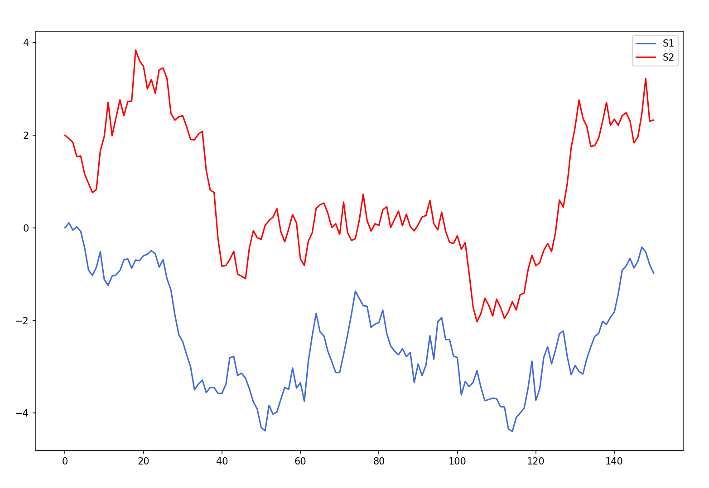

# Python Finance Tools
This package containes serveral python tools for financial modeling. The goal of this package is to allow for easy Monte-carlo simulation of the time progression of covariant securities, option prices and hedged portfolios.  

## Overview

### Simulating securities
In this package, risky securities are represented by the Gaussian Martingale (`MG`) class. This class represents a random variable (RV) with a Gaussian marginal probability distribution, meaning that the discrete changes over time lie on a Gaussian distribution. Each `MG` class instance has an expectation `mu`, a variance `sigma^2`, an `id` as well as a `state` attribute. Instances of the `MG` class may also be _covariant_ with each other, meaning that a change in one `MG` instance implies a change in another `MG` instance. `MG`s are instantiated as follows:
```python
S1 = MG(state=0, mu=0.001, sigma=0.38)
#An RV with initial value 0, expected value per propegation step of 0.001 and a standard deviation of 0.38

S2 = MG(state=2, mu=0.005, sigma=0.4, cov={S1.id:0.035})
#Another RV with a covariance of 0.035 with S1
```
Instances of MGs may also be algebraically manipulated, taking into account their respective attributes. This is useful for finding the risk and return of a certain portfolio (a weighted average of stocks), or calculating the volatility of a price gap (price difference of two stocks) for pricing of options on spreads.
```python
S3 = S1 + S2
#The sum of two MGs

S4 = 2*S1 - S3
#Scalar multiplication and subtraction is also allowed

S1**2, S3/S4, abs(S2)
#However powers, division and absolute values are not (yet) possible
```
One or multiple instances of the `MG` class may be _simultaneously simulated_ with the `timeSeries` class. This class takes the attributes of each inputted `MG` instance and can simulate a possible outcome after a specified time with its `propegate` method. For example, let's simulate `S1` and `S2` from the previous example:
```python
S = timeSeries((S1, S2))

P, dP = S.propegate(N=150)

plt.plot(P[0], label='S1', color='royalblue')
plt.plot(P[1], label='S2', color='red')
plt.legend(), plt.show()
```
Here, `P` are the price histories of the two MGs and `dP` are the differences in prices between each timestep.

As you can see in the plot, the stocks show a strong co-movement due to the covariance.

### Simulating options


